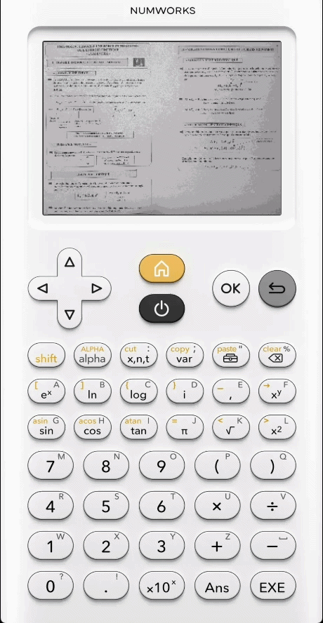

<h1 align="center">Display cheatsheet or any high quality image on the Numworks calculator</h1>

    
    
    
    
     
    
    
    

## 📕 Install the app

To install this app, you'll need to:
1. Download the latest **`.nwa` file** from the **[Releases](https://github.com/SaltyMold/Cheatsheet-Numworks/releases) page**
2. Go to this page : https://saltymold.github.io/Cheatsheet-Numworks/
3. Upload your image and edit it as you want, then click on "Export to bin" and save the file
4. Head to **[my.numworks.com/apps](https://my.numworks.com/apps)** to send the **`nwa` file** on your calculator along the **`bin` file**.

## ⚙️ How to use the app

| Key        | Action            |
|------------|-------------------|
| All arrows | Move in the image |
| OK         | Zoom in           |
| Back       | Zoom out          |

> [!CAUTION]
> The cheetsheet is hiden inside a periodic table. To access it, go to the Carbon element and press the key "9" five times.

## 🛠️ Build the app

I made tutorials here :
- [C-App-Guide-for-Numworks](https://github.com/SaltyMold/C-App-Guide-for-Numworks)
- [Numworks-App-Development-Template](https://github.com/SaltyMold/Numworks-App-Development-Template)
